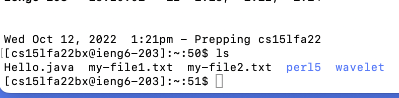
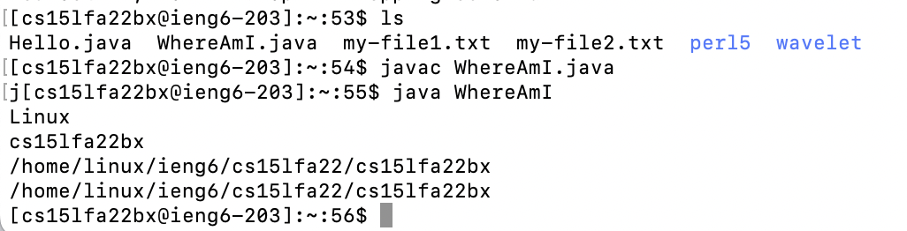
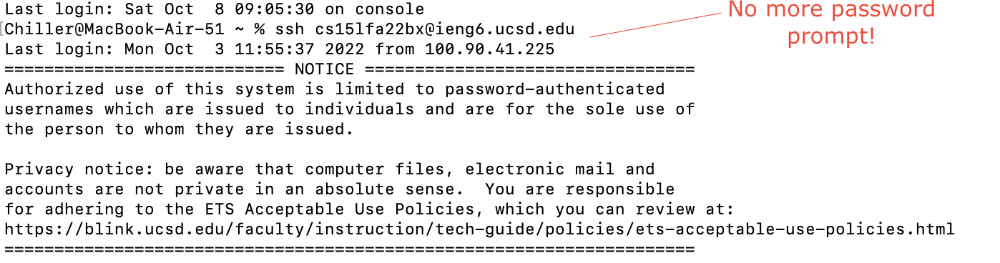
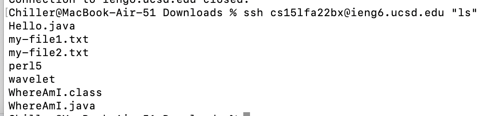

# Lab report, week 1: Lab Tutorial!

## Step 1: Meet your group
- I have met my group already, and you will likely also have a group because that's what programmers like doing. 
- My group is the duck squad. I enjoy being part of this group because of their unique cooking utensil tastes.
- 

## Step 2: Your CSE15L account
- You will have an account associated with your login. Here's the account location: [Your course-specific accounts](https://sdacs.ucsd.edu/~icc/index.php)
- For help on setting your password to get ready for the authentication process to the remote server later on, here's the link: [Resetting your password](https://docs.google.com/document/d/1hs7CyQeh-MdUfM9uv99i8tqfneos6Y8bDU0uhn1wqho/edit)
- 

## Step 3: Install visual studio code
- This is quite simple. Go to the [visual studio code site](https://code.visualstudio.com/) and install the software. Pick your correct version, but you might not be able to install the software on a tablet or chromebook. Ask the TA's for help.
- When the software is installed, the homepage should look like this: [homepage.jpg]()
- Take a screenshot afterwards.
- 

## Step 4: Remotely connecting
- Before beginning this step, check to see if your OS is Windows. If not, you're fine. If you are on windows though, there is an extra step: [Install OpenSSH for Windows (not the client, not the server)](https://learn.microsoft.com/en-us/windows-server/administration/openssh/openssh_install_firstuse?tabs=gui). 
- On the terminal in either visual studio or your native device, type in ```ssh cs15lfa22zz@ieng6.ucsd.edu``` and replace the ```zz``` with your specific student name for the course.
- You can find your cse 15l-specific course username at [this link](https://sdacs.ucsd.edu/~icc/index.php) after typing in your UCSD account credentials.
- Afterwards, the system will prompt you to agree to connect, since this connection is the first time. Type "yes" then type your password to the course-specific account.
-  
- Afterwards, the system will prompt you to verify the authenticity of the host. Type yes, give your password, and you should get a message that starts with "Now on remote server." Congratulations! You've entered the remote server on one of the UCSD computers in the CSE basement.

## Step 5: Running some commands
- You can test out some commands on the remote server. Try testing out commands like ls, cd, pwd, mkdir, and cp. 
- For example, here's the result that happens when I type "ls" onto the remote server.
- 

## Step 6: Moving files over SSH with the scp command
- The scp command stands for "secure copy" and it's used to move files from our local computer to the remote computer!
- To start, start from your local computer. If you're on the remote computer already, type "exit" and you will return to the local computer.
- Create a file called WhereAmI.java and copy this code into the file:
```java
class WhereAmI {
  public static void main(String[] args) {
    System.out.println(System.getProperty("os.name"));
    System.out.println(System.getProperty("user.name"));
    System.out.println(System.getProperty("user.home"));
    System.out.println(System.getProperty("user.dir"));
  }
}
```
- Afterwards, compile and run using commands 
```java
javac WhereAmi.java
java WhereAmI
```

Finally, transfer the files using 
```
scp WhereAmI.java cs15lfa22zz@ieng6.ucsd.edu:~/
```
- The file should be in the remote server now. Compile and run WhereAmI.java on the remote server using javac and java again, and the command should work!
- Here's an example of me successfully running the WhereAmI.java command on the remote server!



## Step 7: SSH keys

- After a while, you'd likely get frustrated of having to type in your password every time you log in to your remote server for your cse 15l account. You can stop doing this by using SSH keys! To do so, follow these steps:
- Run ssh-keygen on your local computer
- You will be prompted to enter a file to save the key. Press enter and keep track of the default location that the file is sent. For Windows, you need to follow the extra ssh-add steps [here](https://learn.microsoft.com/en-us/windows-server/administration/openssh/openssh_keymanagement#user-key-generation).
- You now have 2 files in the default directory, id_rsa and id_rsa.pub. It's stored in the ssh directory of your computer. 
- To start authenticating with SSH, copy the public key to the .ssh directory of your user account on the server by following these commands:
```
# This is client
$ ssh cs15lfa22zz@ieng6.ucsd.edu
(Entering password)
# On server now
mkdir .ssh
exit
# Back to client
scp [The path to your public SSH key] cs15lfa22@ieng6.ucsd.edu~/.ssh/authorized_keys

```
- Some notes:
- Remember to use your student ID when typing cs15lfa22zz@ieng6.ucsd.edu - replace zz with your specific student code.
- This is what the result should look like after you set this up! Cool that you don't have to type in your password anymore, huh?


## Step 8: Making remote running even better
- After authenticating with SSH, you can have the remote server run commands from your computer without logging in! For example, you can type:

```
ssh cs15lfa22@ieng6.ucsd.edu "ls"
```
- add your id after the fa22 and it will list all the files on the current directory of the remote server! Neat!

