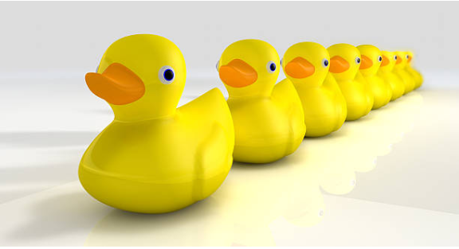
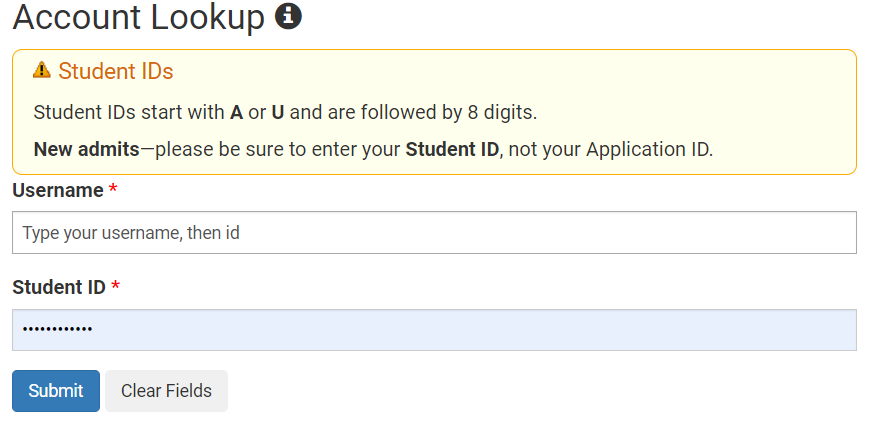
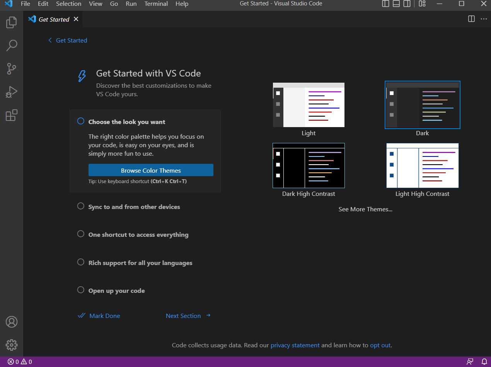
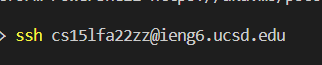

# Lab report, week 1: Lab Tutorial!

## Step 1: Meet your group
- I have met my group already, and you will likely also have a group because that's what programmers like doing. 
- My group is the duck squad. I enjoy being part of this group because of their unique cooking utensil tastes.
- 

## Step 2: Your CSE15L account
- You will have an account associated with your login. Here's the account location: [Your course-specific accounts](https://sdacs.ucsd.edu/~icc/index.php)
- For help on setting your password to get ready for the authentication process to the remote server later on, here's the link: [Resetting your password](https://docs.google.com/document/d/1hs7CyQeh-MdUfM9uv99i8tqfneos6Y8bDU0uhn1wqho/edit)
- 

## Step 3: Install visual studio code
- This is quite simple. Go to the [visual studio code site](https://code.visualstudio.com/) and install the software. Pick your correct version, but you might not be able to install the software on a tablet or chromebook. Ask the TA's for help.
- When the software is installed, the homepage should look like this: [homepage.jpg]()
- Take a screenshot afterwards.
- 

## Step 4: Remotely connecting
- PS: I wasn't able to get past this part, so I can't explain anything further. But simply put, on a terminal (either mac or visual studio) type in ```ssh cs15lfa22zz@ieng6.ucsd.edu``` and replace the ```zz``` with your specific student name for the course.
- Afterwards, the system will prompt you to agree to connect, since this connection is the first time. Type "yes" then type your password to the course-specific account.
-  


I am currently stuck on the authentication process of logging into the remote server.

## Step 5: 

