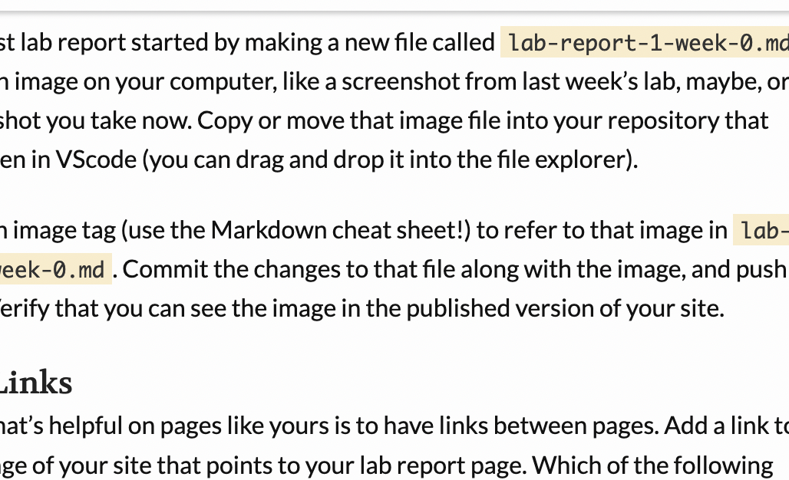

**Testing markdown**

```Very interesting```


Hello world!

*Testing italics*

**Testing Bold**

# Testing heading

## Testing heading 2

[Testing link](google.com)

 



> Testing blockquote


* Testing list
* List
* List


1. Testing list
2. list
3. list


Testing horizontal rule

---

`Testing inline code`

```
testing code blocks
test
test
```
